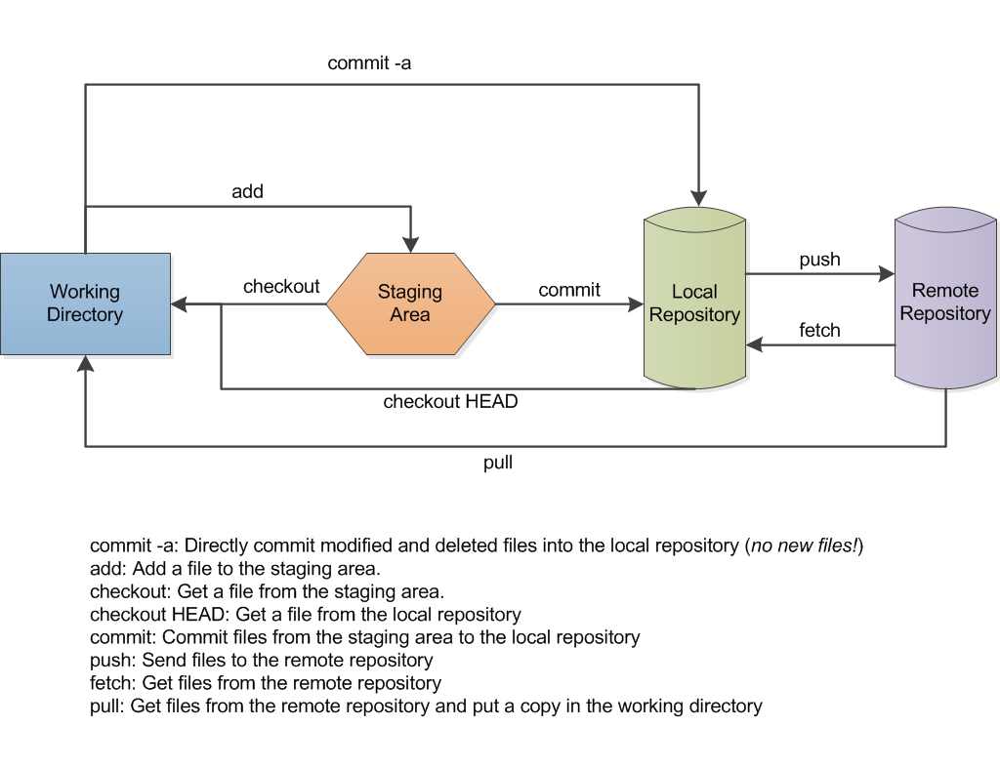
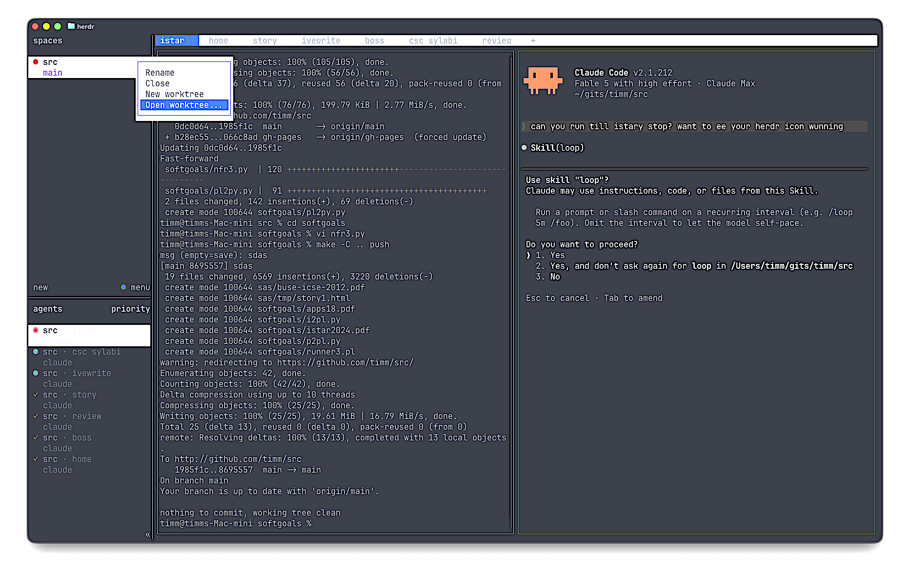

  
  
  
  
  
  
  

<h1 align="center">:cyclone: CSC510: Software Engineering  NC State, Fall '26</h1>

# Git 101: three ways

Teams use git at three levels. Each level is the minimum bar for a later
project. Learn all three tonight. Use the highest level you can handle,
whenever you want.

| Stage | Model | Minimum bar for |
|---|---|---|
| 1 | Shared drive: one folder each, commit to main | Project 1 |
| 2 | Review before merge: branches + pull requests | Project 2 |
| 3 | Agent herding: one worktree per agent | Agent-heavy work |

All of this is standard, well-documented practice. If you get stuck on
any of it, most LLMs can walk you through it — this is exactly the kind
of question they answer well.

### Stage 1: git as a shared drive

One picture first. Your edits move right, in steps: `add` stages them,
`commit` saves them locally, `push` shares them. `pull` brings your
teammates' work back:

Diagram: [Wikimedia Commons](https://commons.wikimedia.org/wiki/File:Git_data_flow.png), CC license.

Six commands:

| Command | What it does |
|---|---|
| `fork` (on GitHub) | Copy someone's repo to your account |
| `git clone URL` | Copy your fork to your machine |
| `git add -A` | Stage your changes |
| `git commit -m "msg"` | Save a snapshot, with a message |
| `git push` | Send your snapshots to GitHub |
| `git pull` | Get your teammates' snapshots |

The discipline that makes this work:

1. One directory, one owner. Everyone works in their own directory,
   almost always.
2. No big shared files. Break shared things into little files, each with
   one owner. Generated artifacts (like the report PDF) are built
   outside the repo, not edited inside it.
3. Commit small and often. Tutors read your history. Many small commits
   from every member earn marks. One giant commit at midnight does not.
4. Never commit a secret. No keys. No passwords. A `.gitignore` lists
   what stays out ([examples](https://github.com/github/gitignore)).
5. The README is your front door. Tutors, and later other teams, judge
   your repo in fifteen seconds.

### Stage 2: review before merge

When two people must touch the same code, stage 1 breaks. Move to
branches. Seven commands:

| Command | What it does |
|---|---|
| `git switch -c feature-x` | Make a branch, start work on it |
| `git add -A; git commit -m "msg"` | Commit on the branch, as usual |
| `git diff main...feature-x` | Show what this branch changed, vs main |
| `git switch main` | Go back to main |
| `git merge feature-x` | Bring the branch's work into main (solo work only) |
| `git push -u origin feature-x` | Team work: publish the branch instead of merging |
| `gh pr create --fill` | Open a pull request for the team to review |

**The rule: someone other than the author reviews every pull request
before it merges.** Make GitHub enforce it: repo Settings → Branches →
require one approving review. No self-merges. Review is where teams
catch bugs, spread knowledge, and prove collaboration to the tutor.

### Stage 3: agent herding

Coding agents run loops, and each loop wants its own copy of the code.
Give each agent a worktree — a separate working directory on its own
branch, sharing one repo. Four commands:

| Command | What it does |
|---|---|
| `git worktree add ../wt-a1 -b agent1` | Make a sandbox directory + branch for agent 1 |
| `git diff main...agent1` | Review what the agent did, before you accept it |
| `git merge --no-ff agent1` | Accept the agent's work into your main |
| `git worktree remove ../wt-a1` | Clean up the sandbox |

The agent works in `../wt-a1` while you work elsewhere. Run several
agents at once: one worktree each, no collisions.

What that looks like in practice — agent left, you right:

(For command line warriors: this screen snap is Ghostty + herdr + Claude Code.)

Left: the agent runs its loop in the worktree — writes tests first,
sees them fail, edits, sees them pass, commits to its branch. Right:
you keep coding on main, undisturbed. Bottom right: your job when the
agent finishes — diff first, merge after YOU review.

This is pull-request discipline without the website: branch, diff,
review, merge. You are the reviewer; the agent is the author. Never
skip the diff — an agent that grades its own work converges on slop.
After the local merge, push and open a real pull request (stage 2) so
a teammate reviews what you and the agent built.
