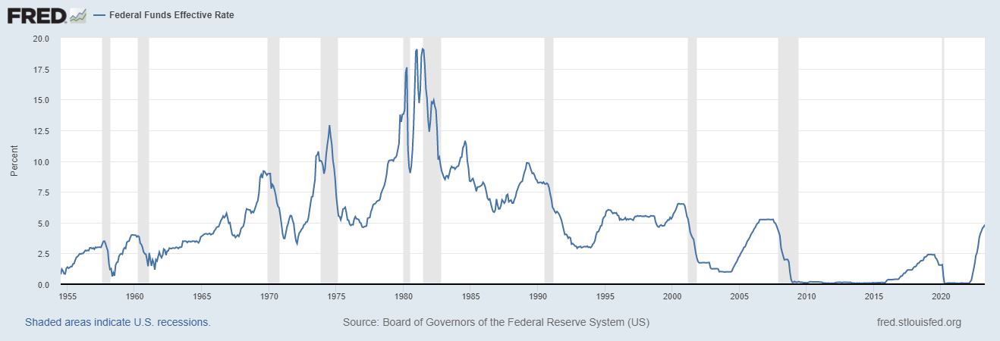
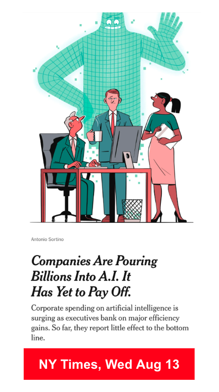
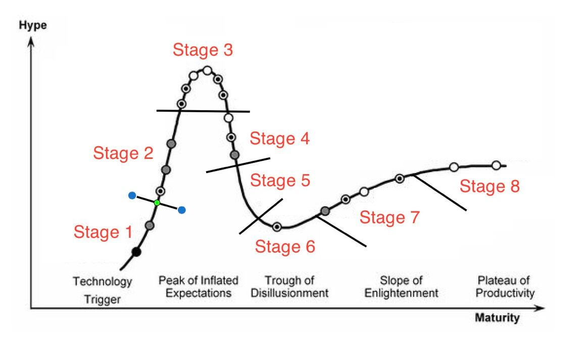
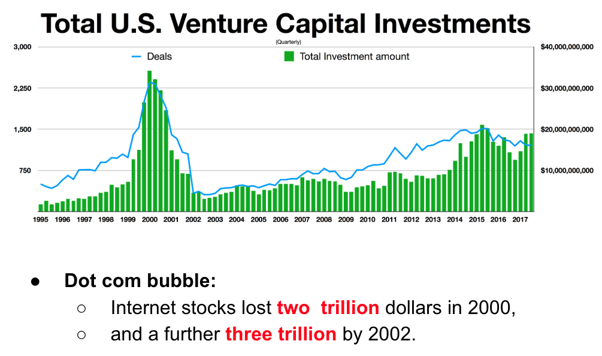
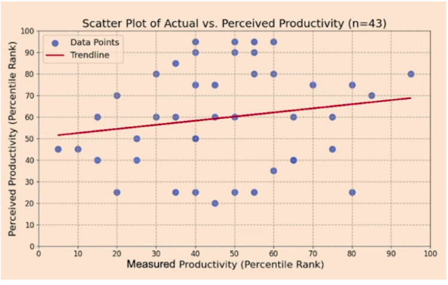
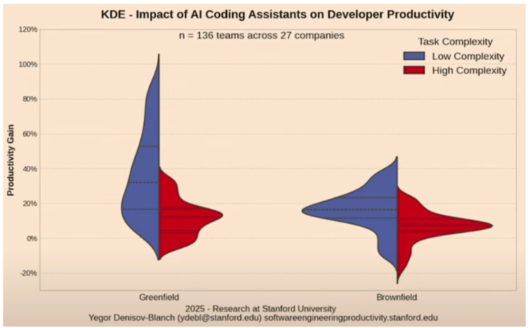
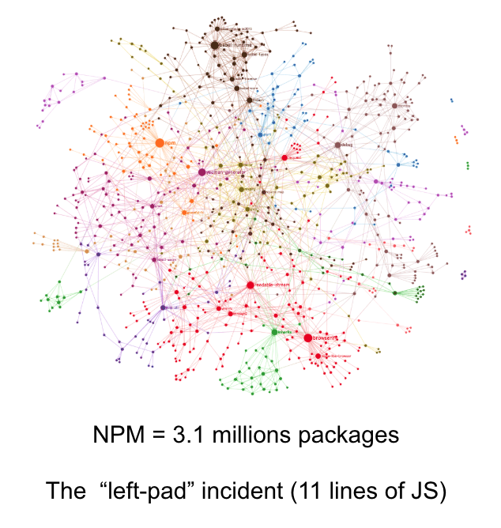

<p align="center">
  <a href="https://github.com/txt/se26f/blob/main/README.md"></a>
  <a href="https://github.com/txt/se26f/blob/main/docs/lect/policies.md"></a>
  <a href="#"></a>
  <a href="https://moodle-courses2527.wolfware.ncsu.edu/course/view.php?id=12082&bp=s"></a>
  <a href="https://discord.gg/zrsW8F2V9"></a>
  <a href="https://github.com/txt/se26f/blob/main/LICENSE.md"></a></p>
<h1 align="center">:cyclone: CSC510: Software Engineering <br>NC State, Fall '26</h1>


# N1: Survival Kit

**Links:** [Home](../../README.md) · [Project 1a](../submit/1/proj1a.md) ·
[Project 1b](../submit/1/proj1b.md) · [Use case format](../submit/1/usecases0.md)

Project 1a starts tonight. This lecture gives you the tools to start it
tonight. Nothing here is deep. All of it is urgent.

Two questions frame this whole course:

- **Q1:** does [vibe code](https://x.com/karpathy/status/1886192184808149383?lang=en)
  == pain maintain?
- **Q2:** how much could, or should, AI change how we build software?

We return to both all semester. We answer Q1 with your own project data,
on the last night.

First, a definition. Memorize it; every project in this course grades
some part of it:

> **Software Engineering** is a process where individuals or teams
> **manage** the **creation and maintenance** of products of **required
> quality** to meet **stakeholders'** needs, given the current
> **constraints**.

And a picture. Classic SE keeps a feedback loop between planning and
testing. Vibe coding skips the planning:

```
     classic SE:                vibe coding:
                                       ^
   Plan <------> Test                  |
      \          /                    Test
       v        v                      ^
         Code                          |
                                     Code
```

- Plans generate expectations. Tests check them.
- Test results tell you which parts of the plan to extend or to cut.
- Skip the planning, and you do not skip the work. You defer it into a
  bigger, later, testing bill. Bugs surface haphazardly, after delivery.

That is Q1 in one picture. Keep it in mind for fifteen weeks.

Our stance, all semester: **AI, carefully.** AI enthusiasm plus
engineering rigor. You will not take a class on how to prompt. You are
taking a class on how to govern.

| Minutes | Segment |
|---|---|
| 15 | Where we are, 2026 |
| 30 | Git, three ways: shared drive, review-before-merge, agent herding |
| 30 | The LLM is a tool. Learn to hold it |
| 50 | Reading alien code |
| 10 | Your two talks: the rules |
| 15 | ACM LaTeX in fifteen minutes |

---

## 0. Where we are, 2026 (15 min)

You are entering this industry at a strange moment. Some context.

### The cost to innovate keeps changing



For decades, US firms could deduct software development costs in the
year they paid them. A 2017 law change ended that: from tax year 2022,
R&D costs — including developer salaries — had to be amortized over 5
years (15 if the work was done offshore). That math kills a startup
that may not exist next year, and it landed right beside the 2022–2024
tech layoffs. In July 2025, Congress restored permanent immediate
expensing — but only for domestic R&D. Foreign development still
amortizes over 15 years. Notice what that means: where programmers get
hired now depends on tax law, not just talent. Your job market moves
for reasons that have nothing to do with code.

### Hype has a shape





Every technology rides the same curve: trigger, inflated expectations,
disillusionment, then the slow slope of real productivity. Ask: where
is generative AI on this curve tonight? Where will it be when you
graduate?

### We have seen bubbles before



The dot-com crash of 2000 wiped out trillions. It also left the fiber,
the frameworks, and the firms that built the next twenty years. Bubbles
burst; infrastructure remains. Build your skills on the infrastructure,
not the bubble.

### What AI actually does to productivity







What does the peer-reviewed evidence say, as of August 2026? Summary
(details and links: [the evidence file](productive.md)):

| Finding | Study |
|---|---|
| +26% tasks completed (3 RCTs, 4,867 devs) | Cui et al., Management Science '26 |
| AI now writes 29% of US Python — yet output rose just 3.6% | Daniotti et al., Science '26 |
| +28.6% lines of code, but +30% warnings and +42% complexity — and the speed fades while the complexity stays | He et al., MSR '26 |
| 21% faster at Google; quality was not measured (p=0.086 adjusted) | Paradis et al., ICSE '25 |
| No change in merged PRs (diary RCT) | Butler et al., ICSE '25 |
| The two famous numbers — 19% slowdown, 56% speedup — are both preprints, not peer reviewed | METR '25; Peng '23 |

And at the organization level, individual gains mostly vanish. DORA
'25: throughput up, instability still negative. Several telemetry
studies: more tasks, more PRs, flat delivery. The mechanism is
queueing, not mystery: generation roughly doubled; review, test, and
integration did not. The surplus becomes work-in-progress, then
instability, then complexity.

So: faster is real, sometimes. Better is unproven. Cheaper is
disputed. This course teaches you to measure, not believe.

The market noticed. In January 2026, Microsoft lost $400B of value in
one week — SE history's largest single devaluation. ChatGPT converts
2–8% of free users to paid. Most enterprise AI apps fail to return
revenue. And the cheap tokens you use today are venture-subsidized;
that subsidy can end.

History says this is normal. Structured programming in the 1970s,
object-orientation in the 1990s, the internet after the 2001 crash:
each rode the hype curve down, then climbed out as an engineering
discipline. The trough is where the engineering gets built. That is
where you come in.

### The money, right now (August 2026)

Venture capital is huge, and narrow. First half of 2026: $413B
deployed — but 81% of it went to rounds of $100M or more, and fewer
than 3% of deals took 79% of all the money. Seed funding fell 27%.
Total deal count is the lowest since 2016. Translation: a few giant
bets on a few AI labs, and fewer new ideas funded than at any time in
a decade.

Markets are wobbling too. The S&P 500 just had its worst July since
2014, led down by AI stocks. Analysts call 2026 the shift "from
expectation to verification": hyperscaler capex heads toward $1
trillion by 2027, and investors now want proof of return. Expect
volatility; the discovery of who actually profits from AI has barely
started.

### The startup question

So can local startup culture start again? Watch the two curves:

- Capital **for** new entrants: scarce (see above).
- Capital **needed** to build: falling. Small open-weight models,
  cheap tooling, and restored R&D expensing keep dropping the price
  of trying.

That is the shape of 2001–2005. When VC money dried up but
infrastructure stayed cheap, the lean bootstrapped startup was
invented: Rails, 37signals, early Y Combinator. If history rhymes,
the next wave is small teams, small models, small budgets — built
anywhere, including here. Which happens to be the exact skill this
course grades: build something real, and test it, with four people
and one month.

### Complexity costs


Every line you add is a line someone must maintain. Hold that thought.
It is tonight's theme, and Project 3's whole life.

---

## 1. Git, three ways (30 min)

Teams use git at three levels. Each level is the minimum bar for a later
project. Learn all three tonight. Use the highest level you can handle,
whenever you want.

| Stage | Model | Minimum bar for |
|---|---|---|
| 1 | Shared drive: one folder each, commit to main | Project 1 |
| 2 | Review before merge: branches + pull requests | Project 2 |
| 3 | Agent herding: one worktree per agent | Agent-heavy work |

All of this is standard, well-documented practice. If you get stuck on
any of it, most LLMs can walk you through it — this is exactly the kind
of question they answer well.

### Stage 1: git as a shared drive

One picture first. Your edits move right, in steps: `add` stages them,
`commit` saves them locally, `push` shares them. `pull` brings your
teammates' work back:


<sub>Diagram: [Wikimedia Commons](https://commons.wikimedia.org/wiki/File:Git_data_flow.png), CC license.</sub>

Six commands:

| Command | What it does |
|---|---|
| `fork` (on GitHub) | Copy someone's repo to your account |
| `git clone URL` | Copy your fork to your machine |
| `git add -A` | Stage your changes |
| `git commit -m "msg"` | Save a snapshot, with a message |
| `git push` | Send your snapshots to GitHub |
| `git pull` | Get your teammates' snapshots |

The discipline that makes this work:

1. One directory, one owner. Everyone works in their own directory,
   almost always.
2. No big shared files. Break shared things into little files, each with
   one owner. Generated artifacts (like the report PDF) are built
   outside the repo, not edited inside it.
3. Commit small and often. Tutors read your history. Many small commits
   from every member earn marks. One giant commit at midnight does not.
4. Never commit a secret. No keys. No passwords. A `.gitignore` lists
   what stays out ([examples](https://github.com/github/gitignore)).
5. The README is your front door. Tutors, and later other teams, judge
   your repo in fifteen seconds.

### Stage 2: review before merge

When two people must touch the same code, stage 1 breaks. Move to
branches. Seven commands:

| Command | What it does |
|---|---|
| `git switch -c feature-x` | Make a branch, start work on it |
| `git add -A; git commit -m "msg"` | Commit on the branch, as usual |
| `git diff main...feature-x` | Show what this branch changed, vs main |
| `git switch main` | Go back to main |
| `git merge feature-x` | Bring the branch's work into main (solo work only) |
| `git push -u origin feature-x` | Team work: publish the branch instead of merging |
| `gh pr create --fill` | Open a pull request for the team to review |

**The rule: someone other than the author reviews every pull request
before it merges.** Make GitHub enforce it: repo Settings → Branches →
require one approving review. No self-merges. Review is where teams
catch bugs, spread knowledge, and prove collaboration to the tutor.

### Stage 3: agent herding

Coding agents run loops, and each loop wants its own copy of the code.
Give each agent a worktree — a separate working directory on its own
branch, sharing one repo. Four commands:

| Command | What it does |
|---|---|
| `git worktree add ../wt-a1 -b agent1` | Make a sandbox directory + branch for agent 1 |
| `git diff main...agent1` | Review what the agent did, before you accept it |
| `git merge --no-ff agent1` | Accept the agent's work into your main |
| `git worktree remove ../wt-a1` | Clean up the sandbox |

The agent works in `../wt-a1` while you work elsewhere. Run several
agents at once: one worktree each, no collisions.

What that looks like in practice — agent left, you right:


<sub>(For command line warriors: this screen snap is Ghostty + herdr + Claude Code.)</sub>

Left: the agent runs its loop in the worktree — writes tests first,
sees them fail, edits, sees them pass, commits to its branch. Right:
you keep coding on main, undisturbed. Bottom right: your job when the
agent finishes — diff first, merge after YOU review.

This is pull-request discipline without the website: branch, diff,
review, merge. You are the reviewer; the agent is the author. Never
skip the diff — an agent that grades its own work converges on slop.
After the local merge, push and open a real pull request (stage 2) so
a teammate reviews what you and the agent built.

---

## 2. The LLM is a tool. Learn to hold it (30 min)

This course asks you to use LLMs, everywhere. It also asks you to
distrust them, everywhere. Both habits matter. Start both tonight.

Why both? The current evidence, in one table:

| Issue | Evidence |
|---|---|
| Hallucination | ~52% of chatbot answers to programming questions contain incorrect information |
| Human error | Humans overlook the AI's errors ~39% of the time |
| Code quality | Generated code: ~29% correct, ~51% partially correct, ~20% incorrect |
| Expert caution | Working developers accept only ~25% of AI code suggestions |
| Training bias | LLMs regenerate old bugs from their training data |

Read that table twice. The tool is powerful. The tool is wrong, often.
The engineer's job is the gap between those two sentences.

### The slop problem

"AI slop" — low-quality AI content, mass-produced — was 2025's word of
the year, and it is now a software problem. A study of 1,154 developer
posts ([Baltes et al. 2026](aislop.pdf)) maps the damage:

- **Review burden moves, it does not shrink.** "The development time
  has been shortened but the team now needs to spend more time to
  review."
- **Real projects are drowning.** The curl project killed its bug
  bounty: AI-generated vulnerability reports ate maintainer time and
  found nothing.
- **It is a tragedy of the commons.** Your speed gain, everyone else's
  review cost.
- **The counter-norm, which this class adopts:** "It's not AI's code,
  it's my code." You own what you submit, and you must be able to
  explain it (see the [policies](policies.md)).

That last point is why your demos are live, your tutors ask questions,
and your rubrics reward review evidence. The course is built to make
slop expensive.

### The prompt pattern

Every good prompt in this course has four parts:

1. **A role.** "You are a senior engineer who joined this project one
   hour ago."
2. **Real evidence, pasted in.** The file tree. The error message. The
   git log. Not a vague description of them.
3. **A fixed output format.** A table. A word limit. Numbered answers.
   Format contracts make the output checkable.
4. **A ban on guessing.** "If you are not sure, write UNKNOWN." "Cite
   the file and line." "Tell me what to paste next."

The [Project 1a prompts](../submit/1/proj1a.md) and
[Project 1b prompts](../submit/1/proj1b.md) all follow this pattern.
Read them as worked examples. Then write better ones.

### Zero-shot versus careful

Ask an LLM "write use cases for this app" and you get mush: generic,
confident, wrong in quiet ways. That is zero-shot prompting.

Careful prompting feeds the format first, with a worked example. Then it
feeds real evidence. Then it demands checkable output. Same model. Same
cost, roughly. Very different value. In Project 1a, you will compare
both and report the difference.

### Context windows

An LLM only knows what is in front of it. Paste beats reference. "Here
is the README" beats "look at my README". Big pastes cost money and can
push out other context. So paste what matters, not everything.

### Hallucination

In 2023, two New York lawyers filed a brief written with ChatGPT. It
cited six court cases. The judge checked. None of the cases existed.
The lawyers were fined, in public, in the press.

The model did not lie. It did what it always does: it produced plausible
text. Plausible is not true. Your defense is the prompt pattern above —
demand citations, then check them. In this course, an invented rival
product or a fake statistic on your poster costs marks the same way the
fake cases cost those lawyers.

### Small can beat big

One more habit of mind. Most of the industry assumes bigger models are
always the answer. The evidence disagrees, often. A recent CACM article
["The Case for Compact AI"](https://doi.org/10.1145/3746057) reports
that only 5% of hundreds of SE-LLM papers even tested a simpler
alternative. When people test, surprises follow: UCL researchers found
SVM plus TF-IDF beat "Big AI" on effort estimation — 100 times faster,
with better accuracy.

Lesson for this course: state-of-the-art results can come from smarter
questioning, not planetary-scale computation. When your LLM bill grows,
ask: is there a smaller way?

### The librarian

Tonight, your team forks a prior project. That repo holds more code,
docs, tests, and history than you can read. Your LLM can read all of it.

So use it as a librarian, not an oracle. Ask where things are. Ask what
matters. Ask what to read next. Then read that yourself. The librarian
fetches; you judge.

Better: make the librarian keep notes. Karpathy's
[llm-wiki 1-pager](../pdf/llm-wiki.pdf) gives nine rules for a
knowledge base the model maintains: raw sources stay immutable, the
model owns the wiki, compile once instead of retrieving forever, link
everything, lint the knowledge for contradictions, start small. Try it
on your fork this week: let the agent build a small wiki of the repo.
Then find one thing the wiki claims that the code contradicts. There
will be one.

---

## 3. Reading alien code (50 min)

### Most of software engineering is this

You will rarely write a system from zero. You will inherit code: from a
past team, a vendor, a colleague who left, or yourself from last year.
Project 1a trains this directly. So does Project 3. So will your job.

### Code rot

Code does not wear out. The world moves, and the code stands still.
Dependencies vanish. Runtimes sunset. APIs change under you.

One famous night in 2016: a developer deleted `left-pad`, an
eleven-line npm package. Within hours, thousands of builds failed around
the world — including builds at Facebook and Netflix. Eleven lines.
Nobody's code changed. The world changed.

Your Project 1a repo is one year old. One year is plenty of time to rot.
Expect it.

### The day-one build rule

- Try to build and run your chosen project on day one. Tonight.
- If it will not run after two days of honest effort, switch projects.
- An early switch costs one afternoon. A late switch kills a team.

When the build fails, triage it with the LLM:
[Project 1a, prompt 6](../submit/1/proj1a.md) — is this code rot, my
setup, or a real bug?

### Technical debt, and why it only grows

Technical debt is the cost of past shortcuts, paid on every change.
Here is the uncomfortable part: humans add, and rarely subtract. A 2021
[Nature study](https://www.nature.com/articles/s41586-021-03380-y)
found people systematically overlook subtractive changes. Asked to
improve designs, subjects proposed 1155 additions and only 297 removals.
Software teams are those subjects. Debt accumulates by default.

So when you read alien code, ask the subtractive question: what could
this system lose and get better?

### Where the bodies are buried

You do not need to read the whole repo to find the fragile parts. Mine
the history:

```
git log --stat --since="2 years ago"
```

High churn plus old age plus TODO density = the rotten wing. Paste that
log into [Project 1a, prompt 5](../submit/1/proj1a.md) and make the LLM
rank the fragile areas — with evidence, not folklore.

### Two ways to read

- **Top-down:** guess the architecture from names and folders. Fast,
  and sometimes wrong.
- **Bottom-up:** trace one real action through the code. Slow, and
  honest.

Do both. Start top-down with the LLM (prompt 1: first contact). Confirm
bottom-up yourself on the one feature you care about.

### Dead code and hidden features

Running systems collect both: functions no use case needs, and features
the README never mentions. Both are findings for your report. Prompt 4
hunts the hidden features. Your 20 use cases should cover what the code
does — not what the README claims.

---

## 4. Your two talks: the rules (10 min)

Each team gives two in-person talks this semester. Each is 15 minutes.
Each is worth 7 marks. See the [schedule](../../README.md) for your slot.

- **Tool talk:** teach us a tool. Not a sales pitch — a working session.
  Show the tool doing something real, live or recorded.
- **Task talk:** teach us a task from your project. What you tried, what
  broke, what you would do differently.

What earns marks: a demo that runs, one idea we remember, finishing on
time. What loses marks: slides full of bullet points, reading to us,
minute sixteen.

---

## 5. ACM LaTeX in fifteen minutes (15 min)

Project 1a's report must be ACM two-column LaTeX. Do not fight this the
night before the deadline. Set it up this week.

1. Open the [ACM template on Overleaf](https://www.overleaf.com/latex/templates/association-for-computing-machinery-acm-generic-journal-manuscript-template/yffvrvzbhhpt).
2. Set the two-column header:

```latex
\documentclass[sigconf]{acmart}
```

3. Or build locally: install [tectonic](https://tectonic-typesetting.github.io),
   then `tectonic main.tex`. Fast, no TeX Live install, works offline.
4. Write in short sections. Tables for results. No minimum length for
   Project 1a: short and dense beats long and padded.

---

## Before next class

1. Form your team of four. Register it.
2. Pick a prior project from the
   [poster folder](https://drive.google.com/drive/u/2/folders/1dGGQNCWC3BakD-nUZn5vPecPdm0KAhXA).
3. Fork it. Build it. Run it. Tonight, not next week.
4. Run prompts 1 and 5 from [Project 1a](../submit/1/proj1a.md) on your
   fork. Bring the strangest thing the LLM told you.

## Reflection

1. Your build fails with a version error in a dependency. Code rot,
   your setup, or a bug? What is the cheapest experiment that tells you?
2. The LLM says your repo has "robust error handling". What evidence
   would make you believe it? What prompt gets that evidence?
3. What could your chosen project delete, and get better?
