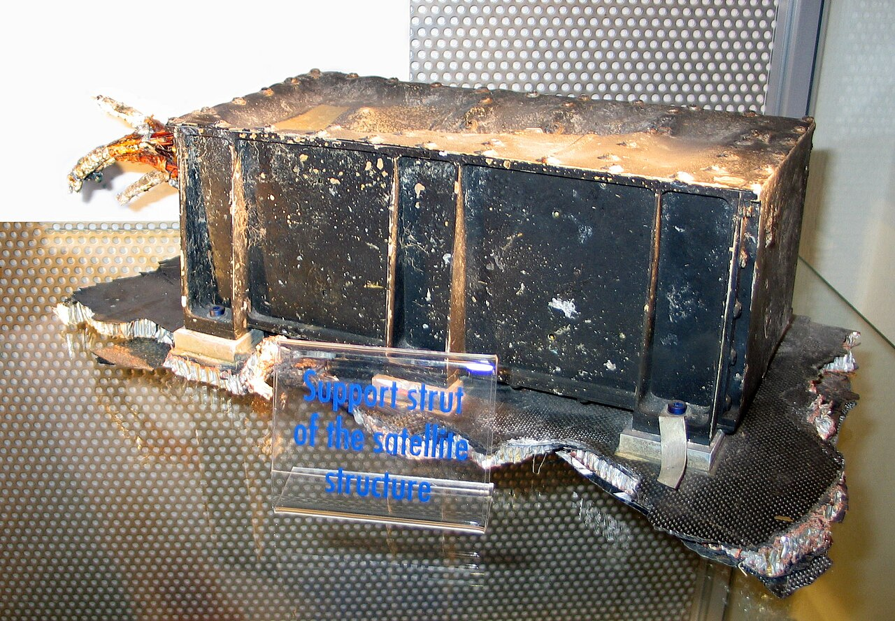
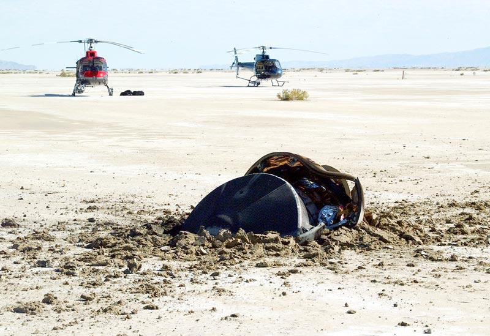
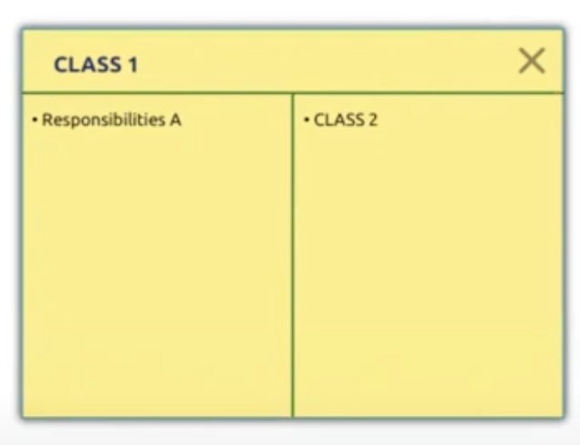
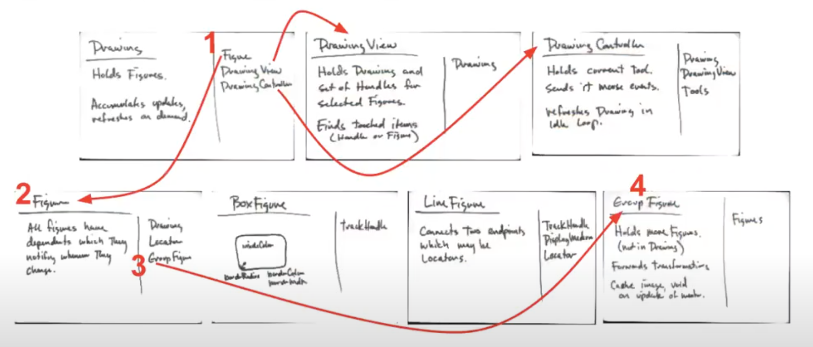
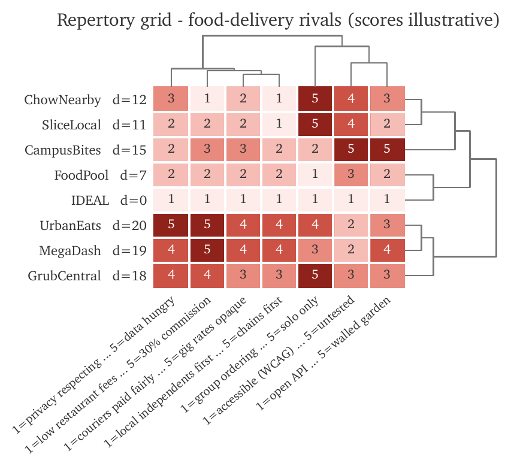
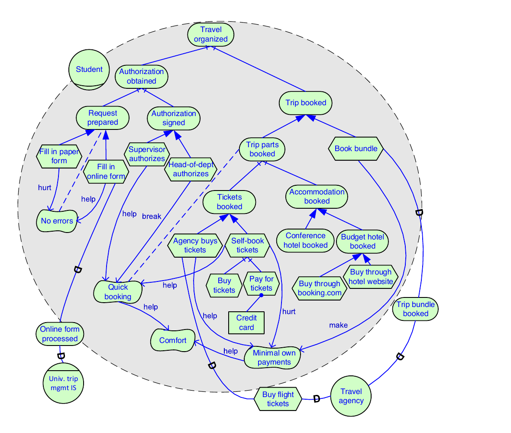
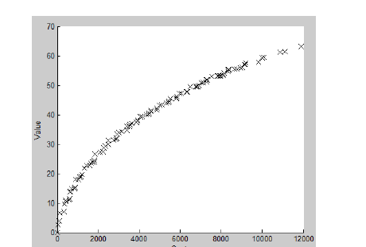
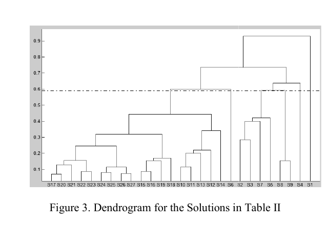
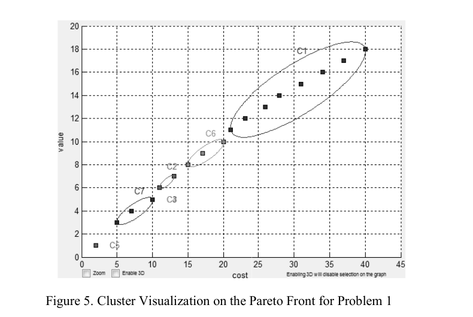
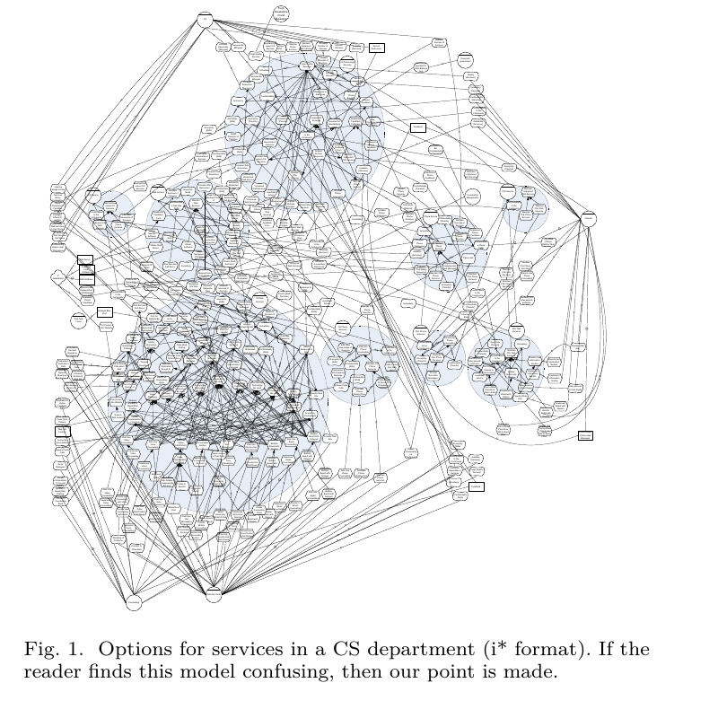

  
  
  
  
  
  

<h1 align="center">:cyclone: CSC510: Software Engineering  NC State, Fall '26</h1>

# N3: Requirements + Stakeholders

**Links:** [Home](../../README.md) · [Project 1b](../submit/1/proj1b.md) ·
[Poster rules](../submit/1/poster.md) · [Use case format](../submit/1/usecases0.md)

Project 1a is due tonight. Project 1b starts tonight. 1a asked: what
does this system do? 1b asks the harder question: what SHOULD it do,
for whom, and why would anyone care?

That question has a discipline: requirements engineering. Tonight is
its greatest hits — mostly its greatest failures, because in
requirements, the failures are the curriculum. Every story below cost
millions of dollars or human lives. Every one traces back not to bad
code, but to a wrong or missing sentence in a requirement.

| Minutes | Segment |
|---|---|
| 30 | Famous requirements failures |
| 40 | Functional, non-functional, and constraints |
| 50 | Stakeholders: who matters, who lies, who gets hurt |
| (bonus) | Research corner: computing the NFR trade-offs |
| 30 | Project 1b launch: twelve prompts and the pivot question |

Recall the V-diagram (N2): requirements sit at the top left, and
acceptance tests sit at the top right, directly across. They are the
same statement in two moods. Requirements engineering works when it
generates tests. Testing works when it can update requirements. Keep
that loop in view all night.

---

## 0. Famous requirements failures (30 min)

### Ariane 5, 1996

Europe's new heavy-lift rocket exploded 37 seconds into its first
flight. The inertial reference software was reused from Ariane 4,
where it had flown for years without fault. But Ariane 5 flew a
steeper, faster trajectory. A horizontal-velocity value overflowed a
16-bit conversion, the backup unit ran the same code and failed the
same way, and the rocket tore itself apart. About $370 million,
gone in under a minute.

The requirement that was missing: "this code's assumptions hold only
for Ariane 4 flight dynamics." The code was correct. The requirement
for reuse was never written. Remember this the night you paste
working code into a new context and an LLM assures you it is fine.

A recovered fragment of flight 501. Photo: [Wikimedia Commons](https://commons.wikimedia.org/wiki/File:Ariane_501_Fragment.jpg), public domain.

### Mariner 1, 1962

A NASA Venus probe veered off course 293 seconds after launch and was
destroyed by range safety. Cause: one missing overbar in a
hand-transcribed guidance equation — popular history calls it "the
most expensive hyphen in history." One character. Precision in
specifications is not pedantry; at machine speed it is survival.

### London Ambulance Service, 1992

London replaced human ambulance dispatchers with a computer-aided
dispatch system. Requirements were gathered fast, against dispatcher
advice, from managers rather than the people doing the work. On
go-live the system lost track of vehicles, sent multiple ambulances
to some calls and none to others. Response times stretched to hours.
The failure contributed to loss of life, and the system was pulled
in days.

The lesson is not "the code was bad." The lesson: the people who
knew the real workflow — dispatchers — were not treated as
stakeholders. Hold that thought for segment 2.

### Mars Climate Orbiter, 1999

Lockheed's ground software produced thruster impulse in pound-force
seconds. NASA's navigation software expected newton-seconds. Nobody
wrote the unit into the interface requirement; nobody's tests crossed
the boundary. The $327 million spacecraft hit the Martian atmosphere
at the wrong altitude and disintegrated. Interfaces between teams are
where requirements go to die — every integration point needs its
assumptions written down and tested.

### Denver airport baggage, 1995 · Heathrow Terminal 5, 2008

Two airports, thirteen years apart, same story. Denver's automated
baggage system — carts shredding luggage in demos — delayed the
airport's opening 16 months at roughly $1 million a day, and was
eventually scrapped. Heathrow T5 opened with a state-of-the-art
system that had never been load-tested against realistic stakeholder
behavior (staff could not log in, could not find parking, bags
flooded the sorters): 42,000 bags stranded, 500 flights cancelled in
ten days. Industries do not automatically learn from each other's
requirements failures. That is why we keep telling these stories.

### Therac-25, 1985–87

A radiation therapy machine, software-controlled, reusing code from
older models that had hardware safety interlocks. The new model
removed the hardware locks and trusted the software. A race condition
— triggered only when an experienced operator typed quickly — fired
the electron beam at roughly 100× the intended dose. Patients died.
The manufacturer insisted for years that the machine could not
overdose.

Two requirements lessons, both still current. First: when you remove
a safety layer, the requirements it silently satisfied do not go
away — they transfer, unwritten, to whatever remains. Second: "it
passed our tests" convinced the manufacturer, not the physics.
Dijkstra again — testing shows presence, never absence.

### Genesis, 2004 → Stardust, 2006

Genesis spent three years collecting solar wind particles, flew home,
and hit the Utah desert at 300 km/h. Its parachute never opened: the
accelerometers that should have sensed re-entry were installed
backwards.

Genesis, as found. Photo: USAF 388th Range Squadron via [Wikimedia Commons](https://commons.wikimedia.org/wiki/File:Genesis_crash_site_scenery.jpg), public domain. A centrifuge test would have caught it. The test was
specified, then skipped — deemed redundant given the "heritage"
design. Two years later Stardust, run with the lessons written into
testing and validation requirements, landed its comet samples
perfectly. Same agency, same era, opposite outcomes: the difference
was whether the verification requirements were honored.

### The pattern

| Failure | Root cause, in requirements terms |
|---|---|
| Ariane 5 | Reuse without re-validating assumptions |
| Mariner 1 | Imprecise specification |
| London Ambulance | Real stakeholders excluded |
| Mars Climate Orbiter | Interface assumptions unwritten |
| Denver / Heathrow | Untested against real-world load and users |
| Therac-25 | Safety requirements silently dropped in reuse |
| Genesis | Verification requirement skipped as "redundant" |

Not one of these is a coding failure. Your Project 1b proposal will
be judged on exactly these dimensions: stated assumptions, named
stakeholders, testable claims.

---

## 1. Functional, non-functional, and constraints (40 min)

Three kinds of requirement. Teams that know only the first kind build
Standard Delivery apps (see [the project](../submit/project.md)).

### Functional requirements

What the system does: "customer places order," "system refunds on
valid complaint." You met these in N2 — use cases are functional
requirements in actor-goal costume.

### Non-functional requirements (NFRs)

How well it does it: availability, performance, security, usability,
maintainability, scalability, portability, compliance. NFRs are
where products live or die — nobody picks a food app because it has
ordering; everybody deletes the one that takes nine seconds to load.

The classic quality test (IEEE 29148): a good requirement is clear,
correct, consistent, complete, feasible, **testable**, traceable.

- Poor: "The system must be fast."
- Better: "95% of searches return in under 2 seconds at 10,000
  concurrent users."

The first cannot fail a test, so it is not a requirement — it is a
mood. Rewrite every NFR until it has a number and a test. (That is
the oracle problem again, N2: no oracle, no requirement.)

NFRs also fight each other. Security hurts usability (every login
step loses users). Performance fights portability and
interoperability. Availability fights consistency. You cannot
maximize them all; you must choose, and your stakeholders (next
segment) tell you which to choose. Write the trade-off down — "we
chose availability over consistency for the order feed because a
stale menu is survivable and a dead app is not" — and put it in your
1b report. Explicit trade-offs read as engineering. Silent ones read
as luck.

### Constraints: requirements you do not get to negotiate

Regulations, standards, and licenses are requirements imposed from
outside. Teams that ignore them meet them later, in court. Three war
stories, one per category:

**Regulations.** Volkswagen's engineers faced an emissions
requirement they could not meet at the price point they wanted. They
wrote code to detect the test rig and cheat it. The fallout: over
$30 billion in fines and settlements, criminal convictions, and an
engineering manager in federal prison. A constraint gamed in software
is still fraud — "I was told to" did not protect the engineers.
Closer to your projects: GDPR fines run to hundreds of millions
(Meta paid €1.2B in 2023), and "we store user data" puts you in
scope the day you launch.

**Standards.** In 2016 a blind customer named Guillermo Robles could
not order a pizza from Domino's website or app with his screen
reader. He sued under the Americans with Disabilities Act. Domino's
fought — not by fixing the site, but by arguing the ADA did not
apply to websites — all the way to the Supreme Court, which declined
to save them. Accessibility lawsuits now run thousands per year in
the US. The standard that defines "accessible" is
[WCAG](https://www.w3.org/WAI/standards-guidelines/wcag/); for
security, the equivalent baseline is the
[OWASP Top 10](https://owasp.org/www-project-top-ten/). Equifax
skipped a patch for a known OWASP-class flaw (an Apache Struts CVE)
in 2017: 147 million people's records taken, roughly $700 million in
settlements. For your projects: WCAG and OWASP are checkable, and
checking them is exactly the kind of milestone that separates your
poster from the pile.

**Licenses.** Open source is free like a puppy is free. GPL code
pulled into a proprietary product obligates the product; companies
from Cisco to Vizio have been sued into compliance. Your Project 2
rubric requires a `THIRD_PARTY_LIBRARIES.md` with licenses listed —
this is why. An LLM will happily paste GPL code into your MIT repo
and say nothing. You are the compliance department.

One more, because it decides lawsuits about the tools you use daily:
Oracle sued Google for reimplementing the Java API in Android —
$9 billion claimed, eleven years of litigation, decided by the
Supreme Court (fair use, 2021). Even the boundary of what you may
reimplement is a requirements question with a legal answer.

### Constraints and LLMs

LLMs know WCAG, OWASP, GDPR, and license texts cold — this is
retrieval, their best event. Prompt pattern (N1) applied: paste your
stakeholder list and product sketch, ask "which regulations,
standards, and licenses constrain this product; cite the specific
clause; write UNKNOWN if unsure." Then verify the citations — the
lawyers from N1 did not, and it cost them. Prior cohorts who ran
this style of constraint-mining found stakeholders and regulations
they had never considered ([evidence](../submit/project.md)).

---

## 2. Stakeholders: who matters, who lies, who gets hurt (50 min)

Without stakeholders, requirements are just ideas. A stakeholder is
anyone who can affect, or is affected by, the system. The starter
list is always too short:

| Group | Example, food-delivery domain |
|---|---|
| Users | Customer ordering dinner |
| Clients / sponsors | The restaurant chain paying for it |
| Domain experts | The dispatcher who has seen every failure mode |
| Developers / maintainers | Whoever answers the pager at 3 a.m. |
| Regulators / legal | Health inspectors, data protection offices |
| Indirect / negative | The courier whose pay algorithm you set; the neighborhood the scooters park in |

The last row matters most and gets found last. Who pays, who
profits, who is harmed, who is ignored, who gets sued when it fails
— [Project 1b prompt 5](../submit/1/proj1b.md) exists to force this
list past the lazy first draft.

### Two stakeholder disasters

**Boeing 737 MAX.** To avoid expensive pilot retraining (a business
constraint), Boeing added software — MCAS — that pushed the nose
down on sensor input, and largely kept it out of the pilot manuals.
The system trusted a single angle-of-attack sensor. When that sensor
failed, MCAS repeatedly overrode the humans. 346 people died in two
crashes; the fleet was grounded worldwide; costs passed $20 billion.
The stakeholder failure: the people who most needed to know the
requirement existed — pilots — were deliberately kept from it, and
the "keep training cost low" stakeholder silently outranked the
"keep the plane flyable by its crew" stakeholder. When stakeholder
priorities conflict, someone decides. If nobody decides on purpose,
the org chart decides by accident.

ET-AVJ, the aircraft lost as Ethiopian 302, a year before the crash. Photo: LLBG Spotter via [Wikimedia Commons](https://commons.wikimedia.org/wiki/File:Ethiopian_Airlines_ET-AVJ_takeoff_from_TLV_(46461974574).jpg), CC BY-SA 2.0.

**Healthcare.gov, 2013.** Dozens of contractors, fifty-odd states,
shifting regulations, no single owner of the end-to-end requirement
"a citizen can enroll." At launch, six people enrolled on day one
while millions failed. A small rescue team later fixed in weeks what
years of process had not — mostly by walking the actual user journey
and fixing what broke, requirement by requirement. Stakeholder
sprawl without an integrating owner produces systems where every
piece passes and the whole fails.

(And from N1's neighborhood: the UK's NHS national IT programme
burned roughly £10 billion before being abandoned — requirements
set nationally, imposed on hospitals that had told them it would not
fit their workflows. London Ambulance, scaled up, two decades
later.)

### The power–interest grid

You cannot serve every stakeholder equally. Sort them:

| Power \ Interest | High interest | Low interest |
|---|---|---|
| **High power** | Manage closely | Keep satisfied |
| **Low power** | Keep informed | Monitor |

Then the uncomfortable question: who is high-interest, low-power?
Often: the courier, the dispatcher, the patient, the blind customer.
The grid tells you they are easy to ignore. The war stories above
tell you what ignoring them costs. Ethical engineering happens in
that bottom-left box.

### Why you cannot just ask people

Elicitation is not "ask users what they want," because:

- **People do not know.** Famous (if apocryphal) Ford line: they
  would have asked for faster horses.
- **People lie politely.** Users tell interviewers what sounds
  responsible, not what they do.
- **Watching changes behavior.** Observed workers follow the manual;
  unobserved workers follow the workarounds that actually run the
  place (the workarounds ARE the requirements).
- **The loudest voice wins.** The highest-paid person's opinion is
  data from exactly one stakeholder.

So elicitation uses multiple instruments, each correcting another:

- **Interviews** — cheap, biased, still essential. Interview the
  quiet stakeholders, not just the sponsor.
- **Observation** — watch the real workflow. London Ambulance was
  one honest week of observation away from a different design.
- **CRC cards** — index cards: one class or component per card,
  responsibilities left, collaborators right. Cheap architecture
  brainstorming a whole team can do standing up:

  

  Real ones look like this — pencil, arrows, arguments
  (Cunningham-style walkthrough of a drawing editor):

  

- **Repertory grids** — from psychology: take three things your
  stakeholders know (three rival apps, say), ask "which two are
  alike, and how is the third different?" The answers surface the
  dimensions people actually judge by — dimensions they could not
  name if you asked directly. Repeat, and a grid of hidden criteria
  emerges. Then cluster it — the trees above and beside the grid
  group similar constructs and similar products:

  

  Read the right-hand tree: the two giant apps cluster together, far
  from IDEAL; the community-pool app sits nearest it. Read the top
  tree: "commission" and "courier pay" travel together — one
  stakeholder value, wearing two labels. That is elicitation output
  you can compute over. (This is a research tool too; ask me how we
  use it.)
- **LLM as elicitation partner** — role-play the missing
  stakeholder: "You are the courier. Here is our design. What do you
  fear?" Synthetic, biased, and still routinely finds concerns the
  team missed. Verify with a human before you build on it.

### Requirements drift

One more failure mode, and it is the one that will actually bite
you this semester. Nobody deletes the requirements document; teams
just quietly stop consulting it. Day-to-day coding decisions
override stakeholder needs one small choice at a time — we call it
requirements drift, and AI-speed coding makes it worse, because the
distance from idea to running code no longer includes a pause for
thought. Your defense is the loop from N2: use cases → tests →
results → updated use cases. If your use cases have not changed in
three weeks of coding, you are not stable — you are drifting.

---

## 3. Research corner: computing the NFR trade-offs (bonus)

Segment 1 said NFRs fight each other, and stakeholders must choose.
Here is the research frontier: making those choices computable.
Three steps, three papers (all in this folder).

**Step 1: write the goals down as a model.** Languages like
[iStar 2.0](1605.07767.pdf) draw stakeholders' goals, the tasks that
achieve them, and the qualities (NFRs) those tasks help or hurt:

Read the arrows: "Fill in paper form" *hurts* "No errors";
"Self-book tickets" *helps* "Quick booking" but *hurts* "Minimal own
payments." This is segment 1's trade-off talk, drawn precisely
enough that a machine can reason over it.

How does this relate to the use cases you wrote in N2? Same
raw material, different geometry — a use case is one path written
as text; an iStar model is the whole space drawn as a graph:

| Use case part (N2) | iStar 2.0 concept | Notes |
|---|---|---|
| Primary actor | Actor | iStar adds actor kinds (agent, role) and links between actors |
| Name (the actor's goal) | Goal | Identical instinct: name the want, not the widget |
| Main success scenario steps | Tasks, AND-refined under the goal | All steps needed — AND |
| Extensions / alternatives | OR-refinement | Different ways to reach the same goal, side by side |
| Stakeholders & interests | Dependencies between actors | "Customer depends on courier for delivery" becomes a first-class arrow |
| NFRs, quality asides | Qualities + help/hurt/make/break links | Use cases mostly mumble these; iStar makes them nodes |
| Preconditions / postconditions / trigger | (no direct equivalent) | Use cases win here — that is why they compile to tests (N2) |
| Trade-off reasoning across the whole system | The point of the notation | Use cases stay silent here — that is why iStar exists |

Rule of thumb: use cases to communicate with stakeholders and to
generate tests; goal models when you must choose between designs.

**Step 2: admit there is no single best answer.** With many
objectives (cost down, value up, risk down...), no one solution wins
everywhere. The honest output is the **Pareto front**: the set of
solutions where improving one objective must damage another
([Veerappa & Letier 2011](2011-clusteringSolutions.pdf)):

Every × is a defensible product. The curve's steep region: cheap
gains, take them. The flat region: paying more buys little. Your
1b milestone plan is a walk along this curve, whether you draw it
or not — drawing it is what turns "we think" into "we chose."

But a front with hundreds of points is itself unreadable. So put a
**hierarchy over the frontier**: cluster the solutions — not by
their scores, but by which design decisions they share (Jaccard
distance over the selected requirements). The result is a
dendrogram, the same picture that sat over the repertory grid in
segment 2:

Cut the tree at a height and the front collapses into a handful of
labeled regions:

Now the stakeholder conversation changes shape. Not "pick one of
104 solutions" but "these six families exist; solutions inside a
family differ in detail, families differ in kind." Watch for
overlapping ellipses — same cost, same value, radically different
designs. That is a decision a human must make, and without the
hierarchy nobody would have seen it.

**Step 3: cope with the scale.** Real models tangle
([Mathew, Menzies, Ernst & Klein](1702.05568.pdf) — their caption:
"if the reader finds this model confusing, then our point is made"):

The escape: **find the keys** (Mathew et al.). In model after
model, a small set of decisions — typically ~12% — controls all the
rest. Fix the keys and the tangle collapses; optimization runs 100
to 1000 times faster, and stakeholder debate shrinks to the few
decisions that matter.

**Step 4: navigate in generations.** None of this is one-shot.
Search-based optimizers work in generations: a population of
candidate solutions breeds, mutates, and is culled against the
objectives; each generation's front pushes closer to the ideal
point. And the human side iterates the same way: cluster the front,
pick the promising family, then re-optimize *inside* that region —
zoom, re-cluster, choose again. Each generation narrows the
trade-off space; a few rounds take you from "104 solutions" to "the
one we can defend." Requirements change mid-project? Re-run the
generations from the current front, not from scratch — yesterday's
frontier is today's seed population. That is trade-off navigation:
not a single decision, but a controlled descent through
generations of better-informed fronts.

**Where this line of work comes from.** There is a clean
intellectual lineage here, four moves long:

1. **RE as theorem proving** (Zave & Jackson, 1997). The classic
   formulation: given domain assumptions *D*, find a specification
   *S* such that *D, S ⊢ R* — the assumptions plus your spec must
   entail the requirements. Requirements engineering as logic: one
   right answer, prove it.
2. **The requirements problem, revisited** (Jureta, Mylopoulos and
   colleagues, c. 2008–2012). Real requirements come with
   preferences, priorities, optional goals, and conflicts. Then
   there is no single *S* to prove — there is a space of candidate
   solutions to search, and "solve" means find the best trade-offs.
   Proof becomes optimization.
3. **Abduction.** How do you generate those candidates? Abductive
   inference: given *D* and a desired *R*, hypothesize the
   assumptions that would make *R* follow, keeping each set
   internally consistent. Each consistent set of assumptions is a
   "world" — one candidate design. My own PhD work sat here:
   abduction over goal models generates the worlds; conflicting
   assumptions split them apart.
4. **Search over the worlds** — which is everything above. The
   worlds are the ×'s on the Pareto front; clustering groups them;
   keys are the few assumptions whose flip moves you between
   clusters. Steps 1–3 gave the semantics; modern search gives the
   speed.

So the research corner is not a grab-bag: it is one 30-year
argument, from "prove the spec" to "navigate the trade-off space."

Moral for your project: most decisions do not matter much; find the
few that do, argue about those, automate the rest. (This is one of
my research areas — like the repertory grids in segment 2. If
computing over requirements models sounds like a thesis topic, come
talk to me.)

---

## 4. Project 1b launch: twelve prompts and the pivot question (30 min)

[Project 1b](../submit/1/proj1b.md), open on your screens. The goal:
you know the product now (1a) — propose a better one. Version i+1.
Different from everything on the market. You may keep the 1a product
and improve it, or dump it entirely: new product, new stack, new
domain. 1a taught you to read a system; spend that skill anywhere.

Hand in: one report, one [poster](../submit/1/poster.md). Due date:
[schedule](../../README.md).

The twelve starter prompts, grouped:

| Prompts | Job |
|---|---|
| 1–3, 7 | Market: map rivals, mine their users' complaints, split table stakes from differentiators, state the gap — with receipts |
| 4 | Evidence: read the support material nobody reads |
| 5 | Stakeholders: who else is in the room (tonight's segment 2, weaponized) |
| 6 | Three futures: conservative, ambitious, weird |
| 8 | Mission statement, minus the buzzwords |
| 9–11 | Reality: milestone check, red team, play to this team's actual skills |
| 12 | The pivot question |

Every prompt follows the N1 pattern: role, pasted evidence, fixed
output format, no guessing. And every prompt carries the hard
constraint — four people, ten hours a week, one month to build AND
test. An LLM that does not know your budget designs you a two-year
product.

**The pivot question (prompt 12) is the one that matters.** It asks:
forget the 1a product — given this team's actual skills and one
month, is there a DIFFERENT project you should build instead? Three
genuinely different alternatives, what each costs to walk to, then a
plain answer: stay or pivot. No hedging.

Teams anchor. You spent a month reading the 1a code, so it feels
like sunk value. It is not — it was training, and it is spent
either way. Some of the best Project 2 repos in past years came from
teams that pivoted hard at 1b; some of the saddest came from teams
that stayed with a product nobody, including them, wanted. Answer
prompt 12 honestly and the rest of the semester gets easier.

**Warning, as ever:** twelve prompts are starters. Higher scores go
to teams that invent better ones. The D5 deliverable — which prompts
earned their keep, which wasted your time — is graded on honesty,
not volume.

---

## Before next class

1. Run prompts 1, 2, and 5 on your 1a product. Bring the most
   surprising rival, complaint, and stakeholder you found.
2. Run prompt 12. Bring your stay-or-pivot answer, one paragraph.
3. Read the [poster rules](../submit/1/poster.md). Posters take
   longer than you think; the QR codes alone have rules.
4. Look at [what good looks like](../submit/project.md) again. Which
   cluster is your proposed product in, honestly?

## Reflection

1. Ariane 5 reused correct code and died. Your team will reuse code
   (and prompts, and designs) all semester. Write the one-sentence
   requirement that makes any reuse safe — then apply it to the last
   thing an LLM generated for you.
2. "The system must be secure" — rewrite it three times: as a
   testable NFR, as a constraint citing a standard, and as an
   extension in a use case. Which version would have helped Equifax?
3. Name the highest-interest, lowest-power stakeholder of YOUR
   proposed 1b product. What design decision would you change if
   they had veto power? Why haven't you changed it anyway?
