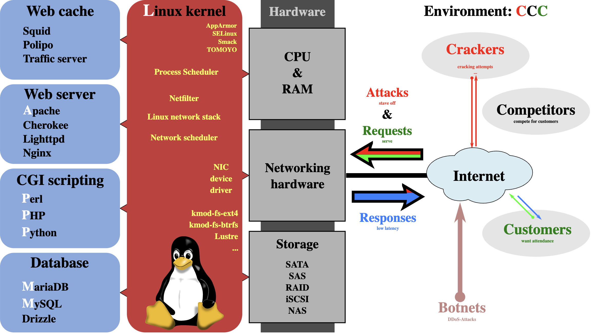
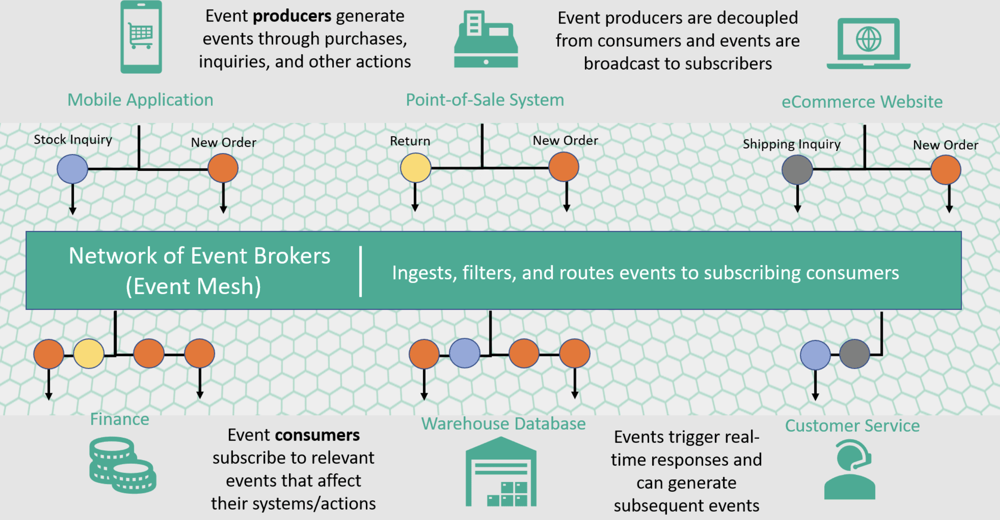
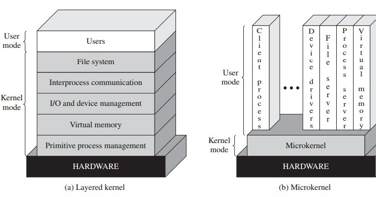
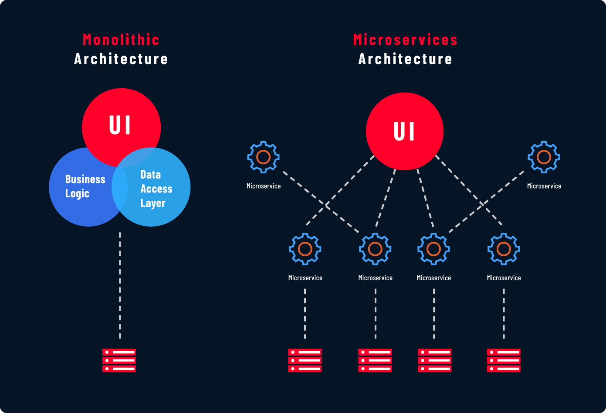

<p align="center">
  <a href="https://github.com/txt/se26f/blob/main/README.md"></a>
  <a href="https://github.com/txt/se26f/blob/main/docs/lect/policies.md"></a>
  <a href="#"></a>
  <a href="https://ncsu.hosted.panopto.com/Panopto/Pages/Sessions/List.aspx#folderID=d778d356-94d2-48b1-a25f-b4a401818991"></a>
  <a href="https://moodle-courses2527.wolfware.ncsu.edu/course/view.php?id=12082&bp=s"></a>
  <a href="https://discord.gg/zrsW8F2V9"></a>
  <a href="https://github.com/txt/se26f/blob/main/LICENSE.md"></a></p>
<h1 align="center">:cyclone: CSC510: Software Engineering <br>NC State, Fall '26</h1>


# N4: Architecture + Design

**Links:** [Home](../../README.md) · [Project 1b](../submit/1/proj1b.md) ·
[Poster rules](../submit/1/poster.md) · [The project](../submit/project.md)

Project 1b is due next week. The proposal you write this week IS an
architecture: every milestone you promise assumes a shape for the
system, whether you drew it or not. Tonight: the classic shapes, what
each one costs, and which ones a four-person one-month team should
actually pick.

An architectural pattern is reusable wisdom about structure — how to
split a system into parts, and how the parts talk. Each pattern
solves a class of problems and quietly bills you for it later. The
skill is not knowing the patterns. The skill is knowing when NOT to
use one.

---

## 0. Eight patterns, with scars ▪▪▪▪▪▪▪▪▪▪▪▪▪▪▪▪▪▪

### Layered

Tiers: presentation, business logic, data access, database. Each
layer hides its internals behind a stable interface, so change stays
local.



The LAMP stack (Linux, Apache, MySQL, PHP) ran the 2000s web this
way, and every layer was swappable — I have changed database engines
midstream; painful, but possible, because the data layer was
honestly isolated.

The scar: layering ossifies. One Fortune 500 insurance app had
thirteen tiers; changing a customer's address touched seven of them.
Abstraction is not free. Too many layers and the architecture stops
protecting change and starts forbidding it.

### Event-driven

Producers publish events; consumers react; nobody calls anybody
directly. Stock exchanges, IoT monitors, ride dispatch.



The scar: debugging. We once chased a logistics bug for weeks — an
event handler firing twice under rare load. The logs showed nothing,
because events have no global ordering. Since then: correlation IDs
on every event, no exceptions. Events scale beautifully and reason
terribly; without observability, event systems rot.

### Microkernel

A minimal core; everything else is a plug-in. Eclipse, VS Code, most
extensible tools.



The scar: I built a GIS tool this way. Lean for a year, then the
plug-ins multiplied, each with a slightly different API style, and
integration became chaos. A microkernel without governance is a
plugin jungle.

### Microservices

Modularity extended to deployment: each service small, independently
deployable, owning its own data.



Netflix runs hundreds — encoding, personalization, billing all
separate, all scaling independently on a Friday night. That is the
brochure. The scar: at a bank, one loan application triggered 47
service calls across 10 teams; latency ballooned and no one person
could debug the whole path. Microservices demand DevOps maturity —
monitoring, CI/CD, service meshes. Without it they collapse.

**For your project: you are four people. You are not Netflix. Build
the monolith first.** A modular monolith you can split later beats a
distributed system you cannot debug now. (Boring technology is a
feature: every exciting choice spends innovation budget you need for
the product itself.)

### Space-based

Computation over a replicated shared memory ("tuple space") — the
Black Friday pattern: no single database choke point. The scar:
replica divergence. Two nodes write the same cart; items vanish;
customers scream. CRDTs fixed it and performance fell. If you do not
need extreme scale, stay away.

### Client-server, manager-agent

The old reliable: clients talk to a server that owns shared state,
over HTTP, gRPC, WebSocket, MQTT. Manager-agent extends it — one
manager delegates to many agents (SNMP monitoring; also, notice,
your N1 agent-herding workflow: you are the manager, worktrees hold
the agents).

### Pipe-filter

Data flows through transformers. Compilers (lex → parse → optimize →
generate). Unix pipes — McIlroy's dream, Thompson's 1973 `|`:

```
cat access.log | grep "ERROR" | cut -d' ' -f2 | sort | uniq -c
```

Text mining: `downcase | tokenise | stem | stopWords | tfIdf |
cluster`. Students who build the compiler as one giant class learn
why this matters: split into filters, and bugs localize.

The limit: pipes are a one-way street. Poor fit for interactive GUIs
where users act in any order.

### The modern web, in one breath

LAMP and MEAN (layered, teachable) gave way to Jamstack (static +
APIs), serverless (billed per request), micro-frontends, edge logic,
hybrid rendering. Same trade-off every generation: more scale, more
moving parts, harder debugging.

### Choosing, for a four-person month

| Situation | Reach for |
|---|---|
| Default. Web/mobile app, one team | Layered monolith, client-server |
| Batch data processing, ML pipeline | Pipe-filter |
| Tool others should extend (proj3 hint!) | Microkernel — plug-ins are a gift to the next team |
| Genuinely event-shaped domain (alerts, streams) | Event-driven, one broker, correlation IDs from day one |
| Résumé says "I wanted microservices" | Layered monolith. Split it in proj3 if the seams demand it |

Your Project 2 rubric rewards "a framework that lets others deliver
milestones" — that is the microkernel instinct at monolith scale:
clean seams, documented interfaces, plug-in points.

---

## 1. Design essentials ▪▪▪▪▪▪

Four ideas run underneath every pattern above:

- **Coupling** — how much modules know about each other. Low
  coupling = changes stay local. The 13-tier address change and the
  47-call loan app are both coupling failures, in opposite
  directions.
- **Cohesion** — how much a module's insides belong together. High
  cohesion = the module has one job, nameable in one sentence. If
  you need "and" to describe a class, it is two classes.
- **Information hiding** (Parnas, 1972) — modules hide decisions,
  not just data. Hide the things most likely to change: the file
  format, the vendor API, the pricing rule. Then change arrives and
  finds one module waiting for it, not seven tiers.
- **Design-for-test** — if a thing is hard to test, redesign the
  thing. Pass dependencies in (so tests can pass fakes), keep I/O at
  the edges, put logic in pure functions. Your N2 tests are the
  first customer of your architecture; if they need a database, a
  network, and a prayer, the coupling is telling you something.

**How to check your architecture, one question:** does it divide
the work so that, at least half the time, everyone can work on
their own bit without pestering other people? Count the
interruptions, not the boxes. If every task starts with "wait, is
anyone touching the order module?" — the diagram may look layered,
but the coupling is telling the truth. (This is also Conway's law
run forward: four people, so design four work-streams with thin,
agreed interfaces between them. The interfaces are where the
pestering is allowed.)

One more, for 2026: **modular design is what makes coding agents
parallelizable.** One worktree per agent (N1) only works when
modules do not stomp each other. High coupling = merge conflicts =
agents wasting your review time.
The pester test applies to agents too — an agent that must
constantly ask what the other agents are doing is an architecture
smell with a token bill.

---

## 2. Project 1b clinic ▪▪▪▪▪▪

Proposal due next week. Two live exercises, then you know what to fix
this weekend.

**Live prompting (20 min).** Prompts 1, 2, 7 from
[proj1b](../submit/1/proj1b.md), run on screen against a real
product. Your job, audience: hunt. Every rival the LLM names — does
it exist? Every "AI-powered seamless experience" — is that a
differentiator or a buzzword? (Recall the N1 lawyers; recall N3's
constraint-mining rule: verify citations.) The gap between what the
LLM asserts and what survives checking is exactly the gap your
report is graded on.

**Milestone realism (10 min).** The budget is arithmetic: 4 people ×
10 hours × 4 weeks = **160 person-hours**, and testing takes its
share (N2: more than you think). For each milestone ask: safe, bold,
or wild? A good proposal mixes them — mostly safe, one bold, wild
only if a kill signal is defined ("if the API key does not arrive by
week 2, we ship the mock"). A proposal of four wild milestones is
a pre-written apology.

If time: prompt 10 (red team) against a volunteer team's mission
statement. Bring armor.

---

## Before next class

1. Project 1b due at start of class. Report + poster
   ([rules](../submit/1/poster.md) — the QR codes have rules).
2. In your report, name your architecture: which pattern, why, and
   the one trade-off you are knowingly accepting. One paragraph.
   (This paragraph becomes your proj2 README's design section.)
3. Run prompt 9 (milestone reality check) with the 160-hour budget
   pasted in. Adjust before the tutor does it for you.
4. Sketch your system as boxes and arrows, one page. If two boxes
   share a database and a grudge, fix it now — it is one line in a
   proposal and a month of pain in a repo.
5. Then run the LLM-as-architecture-critic prompt (N1 pattern:
   role, evidence, format, no guessing): "You are a reviewer who has
   killed three projects like this. Here is our box diagram and our
   four milestones. For each arrow: what breaks under load, what
   breaks in week 3, which module will the merge conflicts live in?
   Cite the box, or write UNKNOWN." Keep what survives your own
   check; the critique that names a real seam goes in the report.

## Reflection

1. Your food app must notify couriers, restaurants, and customers
   when an order changes. Event-driven or client-server? Argue both
   ways, then commit — and name the scar you are risking.
2. Take one milestone from your 1b draft. What would make it a
   coupling disaster (which modules must it touch?), and what
   interface would contain it?
3. The proj2 rubric wants "a framework others extend." Name the
   plug-in point in YOUR design: what exactly does the next team
   implement, and what do they never have to read?
