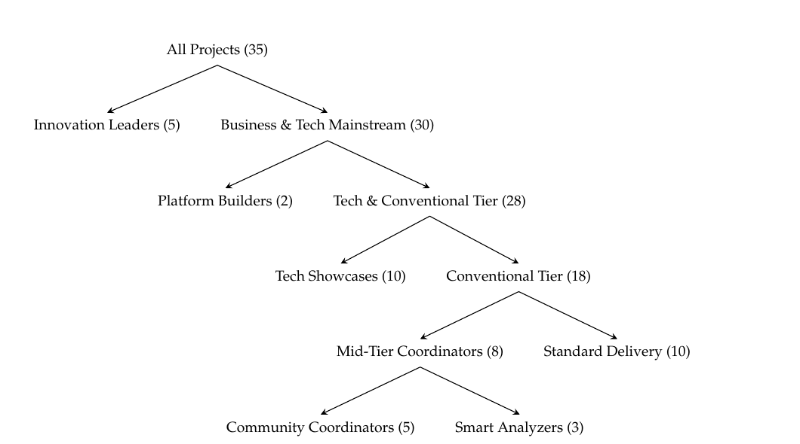
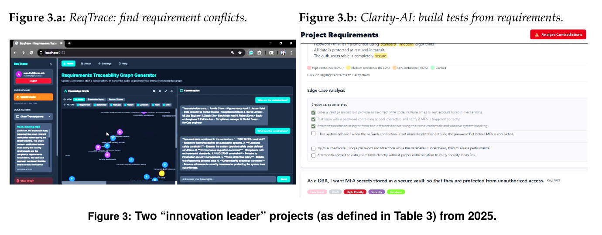
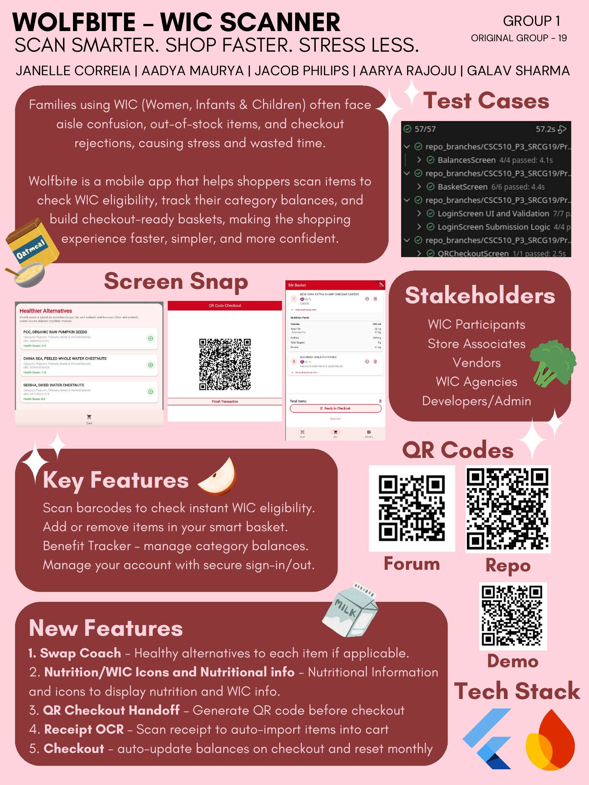

  
  
  
  
  
  
  

<h1 align="center">:cyclone: CSC510: Software Engineering  NC State, Fall '26</h1>

# The Project

**Links:** [Home](../../README.md) · [Project 1a](1/proj1a.md) ·
[Project 1b](1/proj1b.md) · [Project 2](2/proj2.md) ·
[Project 3](3/proj3.md) · [Use case format](1/usecases0.md) ·
[Poster rules](1/poster.md) · [Policies](../lect/policies.md) ·
[Prior projects](https://drive.google.com/drive/u/2/folders/1dGGQNCWC3BakD-nUZn5vPecPdm0KAhXA)

One project, three acts, one team of four, all semester. The aims:

- **(a) A taste of the real job.** Group work, requirements, testing,
  and maintenance — all of it done the modern way, working with LLMs,
  and all of it checked the old way: by humans who read the diffs.
- **(b) A repo worth boasting about.** By December you own a public,
  state-of-the-art repository — built, tested, documented, and then
  extended by another team — that you can proudly show potential
  employers. The repo is the résumé.

## The three acts

| Act | What you do | Hand in |
|---|---|---|
| **Project 1: Explore** | [1a](1/proj1a.md): fork a prior year's project, build it, write 20 use cases, test it, trace tests to use cases, video the evidence. [1b](1/proj1b.md): survey the market, then propose version i+1 — a better product that fills a gap no rival fills. | 1a: report + demo video. 1b: report + [poster](1/poster.md). |
| **Project 2: [Build](2/proj2.md)** | Build your product: four (or more) major, impressive milestones, plus a framework that lets strangers add four more. Sell it — poster, demo, clean public repo. Other teams shop your poster to pick their Project 3. | Poster + repo. The repo is the evidence. |
| **Project 3: [Maintain](3/proj3.md)** | Extend another team's Project 2 by four (or more) major milestones. Their tests keep passing; your new tests join them. Most of software engineering is exactly this. | Poster + their repo URL + your fork. |

Dates: see the [schedule](../../README.md). Grading: see the
[policies](../lect/policies.md).

## What good looks like

We measure this. Our analysis of 35 prior team projects
(from [an NSF proposal](../lect/NSF_teaching_LLM%2017.pdf) built on this
class) clustered them by business value, social impact, human
flourishing, and cognitive complexity:

| Cluster | Definition & general impact |
|---|---|
| **Innovation Leaders** | High social impact with strong wellbeing benefits. Balance technical execution with genuine societal value. |
| **Platform Builders** | Infrastructure projects enabling ecosystems through APIs and extensibility. |
| **Tech Showcases** | Sophisticated AI/LLM applications, novel algorithms — but individual benefit only, no broader impact. |
| **Community Coordinators** | Local social connection at neighborhood or campus scale. |
| **Smart Analyzers** | Mid-tier intelligence: recommenders and optimizers for individual decisions. |
| **Standard Delivery** | Conventional implementations, delivered competently — but little differentiation in impact or business model. |

First, a word about the Standard Delivery apps. Nothing wrong with
delivering standard stuff, on time, on budget. It is OK to deliver to
the spec. It may even be safer — fewer risks, fewer surprises. Most
working software, most careers, live right there, honorably.

But maybe, in the safety of these walls, you might want to stretch
out a little. A semester project is a low-stakes place to try. So
consider the other levels: the teams that reached "Innovation
Leaders" got there not with more code but with better requirements —
asking who else the system serves, and what nobody else builds. Two
of those projects:

Left: **ReqTrace** builds knowledge graphs to find conflicts inside
requirements documents. Right: **Clarity-AI** turns requirement edge
cases into candidate test cases. Both grew out of requirements
exploration, not feature lists.

## What a good poster looks like

One of the better posters from a prior cohort — you know what the
product is in fifteen seconds, the tests are shown running (57/57,
screenshot not claim), stakeholders are named, and three QR codes
take you to repo, forum, and demo:

Two more worked examples, with notes on what to copy from each:
[poster.md](1/poster.md).
